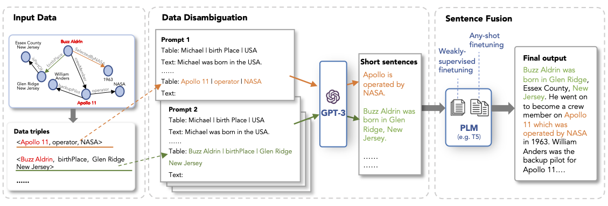

# Any-Shot Data-to-Text
[ASDOT: Any-Shot Data-to-Text Generation with Pretrained Language Model](https://arxiv.org/abs/2210.04325) \
Jiannan Xiang, Zhengzhong Liu, Yucheng Zhou, Eric P. Xing, Zhiting Hu \
Accepted to Findings of [EMNLP 2022](https://2022.emnlp.org/)



## Setting Up
* Python == 3.8

Install the dependencies by
```
pip install -r requirements.txt
```

## Download Weakly-Supervised Checkpoint
We release our ASDOT model that is finetuned with weakly-supervision dataset WikiFluent in [Google Drive](https://drive.google.com/file/d/1_qTlQdbK0sQDv7DXICOtyMdPQ7FNQBc1/view?usp=sharing).
This model can be used for zero-/few-shot settings.

## Usage
WebNLG and DART is in `data/webnlg` and `data/dart`, respectively. We use the WebNLG dataset as the example for usage illustration.

### Sample
For few-shot experiments, you may first sample the dataset by:
```
python sample.py \
  --input data/webnlg/train.json \
  --output data/webnlg/train_20.json \
  --sample 20
```
This command generates a training set that contains 20 samples.

### Training
```
python run.py \
  --train_file data/webnlg/train.json \
  --valid_file data/webnlg/val.json \
  --dataset_name webnlg \
  --model_name_or_path t5-small \
  --source_prefix "summarize: " \
  --input_column input \
  --per_device_train_batch_size 4 \
  --per_device_eval_batch_size 12 \
  --learning_rate 3e-5 \
  --num_train_epochs 40 \
  --output_dir output/ \
  --logging_steps 100 \
  --no_progress_bar \
  --num_beams 1
```
Please use `python run.py --help` to see the usage of the arguments. If you want to train a baseline model (with linearized data as input), please set 
`--source_prefix "translate Graph to English:" --input_column triple --add_special_tokens`.

### Evaluation
```
python run.py \
  --valid_file data/webnlg/test_both.json \
  --dataset_name webnlg \
  --model_name_or_path output/checkpoint_best \
  --source_prefix "summarize: " \
  --per_device_eval_batch_size 12 \
  --output_dir output/ \
  --num_beams 5 \
  --do_eval
```
This command reports BLEU, METEOR and PARENT-F1 of the checkpoint on the corresponding test set.
WebNLG has three test sets: `test_both`, `test_seen`, and `test_unseen`. DART has `test_both` and `test_unseen`.

### Inference / Generation
```
python run.py \
  --valid_file data/webnlg/test_both.json \
  --dataset_name webnlg \
  --model_name_or_path output/checkpoint_best \
  --source_prefix "summarize: " \
  --per_device_eval_batch_size 12 \
  --output_dir output/ \
  --num_beams 5 \
  --do_gen
```

